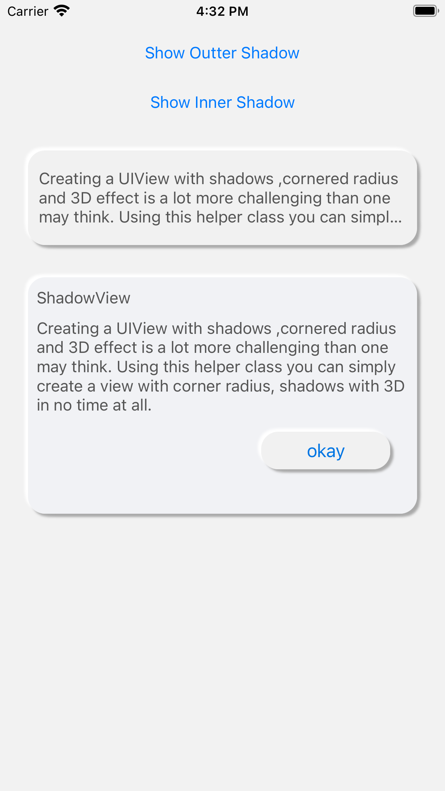

# SNShadow(Neomorphism)
SNShadow with Neumorphism style design. Creating a UIView with shadows , cornered radius and 3D effect(Neomorphism) is a lot more challenging than one may think. Using this helper class you can simply create a view with corner radius, shadows with 3D in no time at all.

## Screenshots

<table>
  <tr>
    <th>
      
    </th>
    <th>
      
    </th>
    <th>
      
    </th>
  </tr>
</table>


`SNShadowView` file contains the custom helper class. Whenever you want to create a UIView of this kind  just make a instance of Class Name class and use the custom initialiser to pass the preferred values for shadowRadius, view's cornerRadius, shadowOffset, shadowOpacity & shadowColor.

## Requirements

- iOS 11.0+ 
- Xcode 10.2+
- Swift 5+
## Installation

### CocoaPods

[CocoaPods](https://cocoapods.org) is a dependency manager for Cocoa projects. For usage and installation instructions, visit their website. To integrate SNShadowSDK into your Xcode project using CocoaPods, specify it in your `Podfile`:

```ruby
pod 'SNShadowSDK'
```

## Usage

### Shadow in View
Use `SNShadowView` class as UIView to make this View has shadow.

#### Use Storyboard


 For Right & Bottom Shadow(shadowWidth1,shadowHeight1) - Give positive value. eg: 2
 
 For Left & Top Shadow(shadowWidth1,shadowHeight1) - Give negative value. eg: -2
 
 - Types of Shadows
   - Outer Shadow - By default shadow will be Outer shadow
   - Inner Shadow - Toggle Inner shadow to `Yes`


#### Programmatically

```ruby
import SNShadowSDK
```
```
@IBOutlet weak var viewOne: SNShadowView!
```
#### Set Shadow
```
@IBOutlet weak var viewTwo: SNShadowView!{
        didSet{
            viewTwo.setInnerShadow()
        }
    }
viewOne.setInnerShadow()
```
#### Function to set Shadow
   - setInnerShadow()
   - setOuterShadow()
